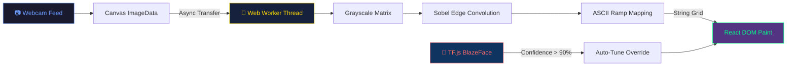

<div align="center">

<!-- Animated Matrix Rain Banner -->


<!-- Animated Typing SVG -->
<a href="#"></a>

<br/>

<!-- Animated Snake Contribution Grid -->
<picture>
  <source media="(prefers-color-scheme: dark)" srcset="https://raw.githubusercontent.com/platane/snk/output/github-contribution-grid-snake-dark.svg"/>
  <source media="(prefers-color-scheme: light)" srcset="https://raw.githubusercontent.com/platane/snk/output/github-contribution-grid-snake.svg"/>
</picture>

<br/>

<!-- Tech Stack Badges -->
<p align="center">
  
  
  
  
  
</p>

<!-- Status Badges -->
<p align="center">
  
  
  
  
</p>

<!-- Navigation Quick Links -->
<p align="center">
  <a href="#-the-concept"></a>
  &nbsp;
  <a href="#%EF%B8%8F-features-that-slap"></a>
  &nbsp;
  <a href="#-the-engineering-for-nerds"></a>
  &nbsp;
  <a href="#-quick-start"></a>
  &nbsp;
  <a href="#-meet-the-builder"></a>
</p>

</div>

---

<!-- Wave Divider -->


<br/>

## 🎯 The Concept

> **What if your webcam could paint with letters?**

```
██╗    ██╗███████╗██╗      ██████╗ ██████╗ ███╗   ███╗███████╗    ████████╗ ██████╗
██║    ██║██╔════╝██║     ██╔════╝██╔═══██╗████╗ ████║██╔════╝    ╚══██╔══╝██╔═══██╗
██║ █╗ ██║█████╗  ██║     ██║     ██║   ██║██╔████╔██║█████╗         ██║   ██║   ██║
██║███╗██║██╔══╝  ██║     ██║     ██║   ██║██║╚██╔╝██║██╔══╝         ██║   ██║   ██║
╚███╔███╔╝███████╗███████╗╚██████╗╚██████╔╝██║ ╚═╝ ██║███████╗       ██║   ╚██████╔╝
 ╚══╝╚══╝ ╚══════╝╚══════╝ ╚═════╝ ╚═════╝ ╚═╝     ╚═╝╚══════╝       ╚═╝    ╚═════╝

  A S C I I   S T U D I O   ×   B Y   M A N A M N A T H   T I W A R I
```

**ASSCAM** isn't just a webcam filter. It's a **real-time computational art engine** running entirely in your browser. Zero cloud. Zero latency. Zero compromise.

It takes your live camera feed, processes every frame through a multi-stage pipeline—**Grayscale Projection → Sobel Edge Detection → AI Auto-Tune → ASCII Ramp Mapping**—and renders a living, breathing artwork made of pure text, at up to **60 frames per second.**

<br/>

## ✨ Features That Slap

<!-- Feature Grid using HTML table for alignment -->
<table>
  <tr>
    <td width="50%" valign="top">

### 🧠 AI Auto-Tune
Stop tweaking sliders like it's 2005. ASSCAM's `useAutoTune` hook runs **Google's BlazeFace** neural network inside a background loop. It detects faces with >90% confidence, analyzes ambient luminance, and **automatically recalibrates** the entire studio preset in real-time. Your art always looks stunning.

    </td>
    <td width="50%" valign="top">

### ⚡ Zero-Lag Web Worker Engine
Rendering **15,000+ text characters per frame** at 60fps should melt any browser. ASSCAM **offloads the entire render pipeline** to an asynchronous Web Worker — raw `ImageData` transfers, Sobel convolutions, character mapping — all off the main thread. The UI stays butter smooth.

    </td>
  </tr>
  <tr>
    <td width="50%" valign="top">

### 💎 Glassmorphic Studio UI
Forget every ugly dev-tool UI you've ever seen. ASSCAM features **Apple-grade frosted glass panels**, dynamic ambient background blobs, chunky interactive sliders, and segmented tab ribbons — built entirely from hand-crafted CSS. Pure frontend obsession.

    </td>
    <td width="50%" valign="top">

### 🎨 10+ Cinematic Render Modes
Switch between **Hacker Green**, **Duotone**, **Glitch**, **Neon**, **Heatmap**, **Threshold**, and more — live, in real-time. Every mode has its own luminance logic, character weight, and color blending to produce a completely unique visual identity.

    </td>
  </tr>
</table>

<br/>

<!-- Animated Divider -->
<div align="center">
  
</div>

<br/>

## 🛠️ The Engineering (For Nerds)

> The browser is an operating system. ASSCAM proves it.



### The Frame Pipeline — Step by Step

| Step | What Happens | Where It Runs |
|------|-------------|---------------|
| **1. Capture** | `<video>` tag reads the camera stream secretly in the background | Main Thread |
| **2. Draw** | Every animation frame, the feed is drawn to an offscreen `<canvas>` | Main Thread |
| **3. Transfer** | `ImageData` buffer is **transferably cloned** into the Web Worker (zero-copy) | Async Bridge |
| **4. Process** | Custom matrix multiplication computes luminance; Sobel operator detects edge density | Web Worker 🔥 |
| **5. Map** | Luminance values are indexed into a weighted ASCII ramp (`$@B%8&WM#...`) | Web Worker 🔥 |
| **6. Render** | React paints the string grid into the DOM at native refresh rate | Main Thread |
| **7. AI Tune** | `useAutoTune` hook polls BlazeFace every ~2s; overrides presets if face detected | Background Loop |

<br/>

### 📦 Tech Stack Breakdown

```
┌─────────────────────────────────────────────────────────────┐
│  ASSCAM TECH MATRIX                                         │
│─────────────────────────────────────────────────────────────│
│  Frontend Framework  →  React 18 (Concurrent Mode)          │
│  Build Tool          →  Vite 5   (HMR + ESBuild)            │
│  AI/ML               →  TensorFlow.js + @blazeface          │
│  Concurrency         →  Web Workers API (Transferable)      │
│  GPU Acceleration    →  WebGL Backend (via TF.js)           │
│  Styling             →  Raw CSS (Glass, Blobs, Animations)  │
└─────────────────────────────────────────────────────────────┘
```

<br/>

## 🚀 Quick Start

**Ready in under 2 minutes. No accounts. No setup hell.**

```bash
# ① Clone the repo
git clone https://github.com/manamnathtiwari/AssCam.git

# ② Navigate in
cd AssCam

# ③ Install dependencies (takes ~30 seconds)
npm install

# ④ LAUNCH  🚀
npm run dev
```

```
✓ Ready at  http://localhost:5173/
```

> **Note:** When prompted, **allow camera access** in your browser. ASSCAM is 100% local — your camera feed never leaves your machine.

<br/>

### 🏗️ Production Build

```bash
npm run build   # → Outputs to /dist (deploy on Vercel / Netlify / GitHub Pages)
```

<br/>


<br/>

## 👋 Meet the Builder

<div align="center">


</div>

I'm a **relentless software engineer** and creative technologist. I believe that code shouldn't just *function* — it should **perform beautifully under the hood and look breathtaking on the screen**.

ASSCAM is a glimpse of how I approach every build:

- ⚙️ **Aggressively modern** tech stacks
- 🏎️ **Unapologetic** performance optimization
- 🎨 **Absolute obsession** with user experience

> If you're building something ambitious, solving heavy computational problems on the frontend, or simply looking for an engineer who *gives a damn about the details* — **let's talk**.

<br/>

### 📬 Connect With Me

<div align="center">

[](mailto:manamnathtiwari@gmail.com)
&nbsp;
[](https://www.linkedin.com/in/manamnathtiwari)
&nbsp;
[](https://github.com/manamnathtiwari)

</div>

<br/>

<!-- Footer Wave -->

